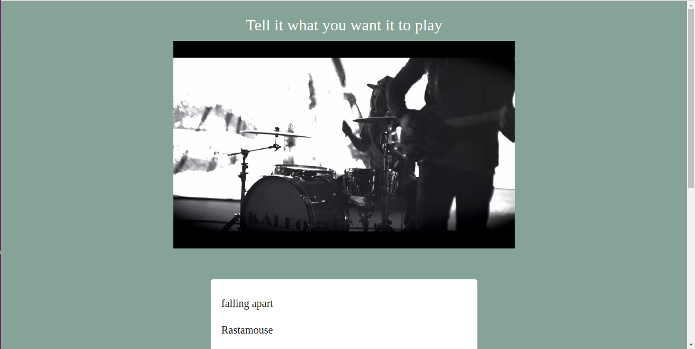

# Voice activiated youtube player

Hosted on heroku: https://song-request.herokuapp.com/

I wanted to try out speech recognition, so I built this node.js app, which takes user inputs and prints them to the screen (mostly so you can see what the speech recognition software thinks you've said). If you say 'Play...[something]' the app requests whatever you said after the word 'play' and gets it from youtube. I watched Javascript30 to get an understanding of how to use the Web Speech API.

### Tools
- [MDN Speech recognition](https://developer.mozilla.org/en-US/docs/Web/API/SpeechRecognition)
- [Youtube API](https://developers.google.com/youtube/)
- [MaterializeCSS](http://materializecss.com/)
- [Env2](https://www.npmjs.com/package/env2)
- Hapi & handlebars

### Still to come
- Tests
- Additional functionality for the player (stop, go, replay)
